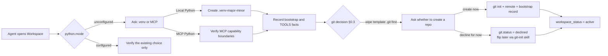

<div align="center">

[简体中文](README.md) | **English**

# WorkspaceTemplate

**A business-agnostic Workspace governance template that is not tied to a single Agent client.**

Start from a clean, auditable rule skeleton so an Agent confirms the Python runtime, business boundaries, tool facts, and skills sources before doing real work.

[](AGENT_RULES.md)
[](scripts/verify_rules.py)
[](.workspace/bootstrap.json)
[](scripts/inspect_skills.py)

[Quick Start](#quick-start) · [First Open](#what-happens-on-first-open) · [Rule Layering & Integrity](#rule-layering-and-integrity-verification) · [Lifecycle Skills](#workspace-lifecycle-skills) · [Repository Layout](#repository-layout) · [FAQ](#faq)

</div>

---

## Why It Exists

Most new Agent Workspaces do not lack code. They lack a stable foundation that will not drift from one conversation to the next:

- Multiple Agent clients should follow one policy instead of maintaining similar copies that slowly diverge.
- Python is extremely useful, but an Agent should not create environments, access the network, or install a large dependency bundle before the user decides how Python should run.
- Skills should be onboarded by directory while preserving source, revision, name-conflict, and side-effect boundaries.
- Business goals, runtime facts, long-term experience, and Agent policy should live in separate layers.
- Your own custom rules should not be tangled into the template baseline, where they would cause sync conflicts.
- External documents and tools may add capability, but they must not grant themselves additional authority.

WorkspaceTemplate turns those principles into a small, explicit set of files. It can grow into a software project, data-analysis workspace, research repository, content workflow, operations project, or any other authorized business environment without forcing a technology stack up front.

> [!IMPORTANT]
> The repository root is the usable Workspace template; there is no second template directory to enter. The README is a GitHub landing page and onboarding guide, not an Agent policy source. [`AGENT_RULES.md`](AGENT_RULES.md) is the sole authoritative policy.

## Core Capabilities

| Capability | How the template provides it |
|---|---|
| One policy source | [`AGENT_RULES.md`](AGENT_RULES.md) governs primary and delegated Agents; client entry files only point to it |
| Rule layering | Template-layer files are **locked read-only** (sync = whole-file replacement); local rules live in `<file>.custom.md` and **custom takes precedence** (§10) |
| Integrity verification | Stable clause IDs (`<!-- id:Rn -->`) + registry-based two-level verification; `--vs-template` byte-compares against the template clone with a **git trust anchor**, closing the "edit the file then regenerate the registry" self-attestation hole |
| Lifecycle skills | `template-update` (sync new templates), `workspace-init` (adopt legacy workspaces), and `git-init` (create a repo later) ship in `.workspace/skills/` |
| First-init protocol | [`.workspace/bootstrap.json`](.workspace/bootstrap.json) persists `python.mode` (**mandatory**: local-venv / mcp) and `git.status` (**optional**: initialized / declined) |
| Business-agnostic foundation | [`WORKSPACE.md`](WORKSPACE.md) starts undefined and is shaped by the user's stable goals, scope, and acceptance criteria |
| One-path skills onboarding | The user provides a root directory; the Agent discovers entries, records fingerprints, and resolves duplicate names |
| Traceable environment facts | [`TOOLS.md`](TOOLS.md) records verified runtimes, MCP services, tools, sources, and side effects without granting authority |
| Progressive knowledge reuse | [`notes/`](notes/) stores reusable experience with a layered index (compact routing + on-demand inverted index) and a curation cadence against fragmentation |
| Client memory boundary | Workspace experience goes only to `notes/`; each client's global memory (Hermes memory / Claude Auto Memory / Codex built-in memory) keeps at most one pointer to `notes/INDEX.md` (§9.1) |
| Safe defaults | External skills are read-only by default; Hooks, dependency installation, networking, and data transfer are never automatic |

## Quick Start

### Option 1: Create a Repository from the GitHub Template (Recommended)

1. Click **Use this template** on the repository page and choose **Create a new repository**.
2. Clone the new repository and open its root with an Agent that supports Workspace rules.
3. The Agent first asks about the Python runtime (mandatory), then the git repo decision (optional).
4. Describe your business goal and get to work.

### Option 2: Clone Directly

```bash
git clone https://github.com/KinoluKaslana/WorkspaceTemplate.git my-workspace
cd my-workspace
```

> [!NOTE]
> The clone ships a `.git` that points at the template repository. On first init the Agent **wipes the template git markers** per §0.3 (only after confirming the remote and exporting any local-only commits as patch backups), then asks whether you want to turn the workspace into its own git repository. You don't have to manage remotes by hand; if you skip the init protocol and develop directly, remove `.git` yourself (`rm -rf .git`) or repoint it at your own remote to avoid pushing back to the template.

Then open `my-workspace` with your Agent. Codex reads [`AGENTS.md`](AGENTS.md), Claude Code reads [`CLAUDE.md`](CLAUDE.md), and Hermes reads [`HERMES.md`](HERMES.md). Other clients should be explicitly instructed to read [`AGENT_RULES.md`](AGENT_RULES.md) and [`.workspace/bootstrap.json`](.workspace/bootstrap.json) in full before working.

**Already on an older template workspace?** Say "initialize / adopt this workspace" to it, or have the Agent run the [workspace-init skill](#workspace-lifecycle-skills) — it inventories the workspace, migrates local edits into the custom layer, syncs the latest template, and handles the venv and git decisions.

## What Happens on First Open

The template does not choose a Python environment for the user. While `python.mode` is `unconfigured`, the first Agent must ask:

> Would you like me to automatically initialize a local, versioned venv for this Workspace (recommended), or use the Python environment provided by MCP in the current session?



The two Python modes are mutually exclusive; switching later requires an explicit user request. **venv is mandatory, git is optional**: a workspace that declines a repo stays a plain file workspace, and you can say "create a git repo" at any time to trigger the git-init skill.

### Python Runtime Options

| | Local versioned venv | MCP Python |
|---|---|---|
| Best for | Projects that need stable file access, reproducible dependencies, and local scripts | Sessions where the user does not want local Python initialization or already has a managed compute environment |
| Initialization | Creates `.venv-<major><minor>` | Creates no local venv |
| Network by default | No; it does not upgrade pip or install dependencies automatically | Depends on verified MCP capabilities and must be recorded |
| File access | Uses paths inside the Workspace | Must be verified; if files are invisible, MCP is limited to pure computation |
| Dependency persistence | Persists inside the venv | Depends on the MCP provider and must not be assumed |
| If unavailable | Reports the exact interpreter or `venv`-module blocker | Never pretends configuration succeeded; asks the user to connect MCP or fall back to a local venv |

The bundled Python scripts use only the standard library and require Python 3.10 or later. None of them run before a runtime has been selected.

## Rule Layering and Integrity Verification

Governance files live in two layers. This is the fundamental reason template sync produces no merge conflicts:

| Layer | Files | Owner | Sync behavior |
|---|---|---|---|
| **Template layer (locked)** | `AGENT_RULES.md`, `AGENTS/CLAUDE/HERMES.md`, `README*`, `notes/rebuild_index.py`, `notes/_TEMPLATE.md`, `scripts/*.py`, `.workspace/skills/`, `.workspace/rule-clauses.json` | Template | **Whole-file replacement**, byte-identical to the template |
| **Custom layer** | `*.custom.md` (e.g. `AGENT_RULES.custom.md`) | Workspace | Never touched; **takes precedence on conflict with the template layer** |
| **Workspace layer** | `WORKSPACE.md`, `TOOLS.md`, `notes/*.md`, `skills/REGISTRY.md`, bootstrap local values, task directories | Workspace | Never touched |

Custom clauses declare their relationship to template clauses via `overrides: R<id>` / `extends: R<id>`. If a template clause is deleted or rewritten and a reference goes stale, the verification script names it and the sync skill asks you to rule on each one — **custom semantics are never silently dropped**.

**How do you confirm a rules file was not tampered with?** Two paths:

```bash
# Fast self-check: file hashes + clause-level comparison (add/delete/edit/reorder)
python3 scripts/verify_rules.py --workspace .
# Authoritative check: byte-compare against the template clone + git trust anchor
# (GitHub object hashes -> clone HEAD -> workspace bytes equal)
python3 scripts/verify_rules.py --workspace . --vs-template ~/Github/WorkspaceTemplate
```

Clause IDs (`<!-- id:Rn -->`, maintained by [`scripts/mark_rules.py`](scripts/mark_rules.py), registry at `.workspace/rule-clauses.json`) make "the user added a clause or reordered clauses in a template file" show up as precise drift instead of a sync conflict later. The local registry can be regenerated, so **the authoritative verdict only trusts `--vs-template`**.

## Workspace Lifecycle Skills

Three skills ship with the template in `.workspace/skills/` (workspace-skills namespace) and are registered in `skills/REGISTRY.md` and `TOOLS.md`:

| Skill | Version | Trigger | What it does |
|---|---|---|---|
| [template-update](.workspace/skills/template-update/SKILL.md) | v2.0 | "sync the template / update to the latest template", or detecting a version lag | Seven-step locked-replacement sync: template source → verify → backup → whole-file replacement → custom-reference migration → bootstrap write-back → `--vs-template` authoritative verification |
| [workspace-init](.workspace/skills/workspace-init/SKILL.md) | v1.0 | "initialize / adopt this workspace", or detecting no template lineage / no clause markers / `.git` pointing at the template | Nine-step adoption of a legacy workspace: inventory → diff verdict → pre-v2.0 migration (externalize local semantics into custom) → venv → git wipe and decision → registry → verify → report |
| [git-init](.workspace/skills/git-init/SKILL.md) | v1.0 | "create a git repo", or the user changes their mind after bootstrap `git.status=declined` | Five-step repo creation: decision → `git init` + first commit → .gitignore check → bootstrap git-node record → verify |

## How It Works

The template separates entry points, policy, custom rules, business context, state, facts, routing, and experience:

| Layer | File | Responsibility |
|---|---|---|
| Client entry points | [`AGENTS.md`](AGENTS.md), [`CLAUDE.md`](CLAUDE.md), [`HERMES.md`](HERMES.md) | Direct different clients to the shared policy without copying it |
| Authoritative policy | [`AGENT_RULES.md`](AGENT_RULES.md) (locked) | Modes, scope, trust, safety, multi-Agent collaboration, delivery, rule layering, and completion criteria |
| Local rules | `*.custom.md` | User/Agent local rules; custom takes precedence, sync never touches them |
| Business profile | [`WORKSPACE.md`](WORKSPACE.md) | Long-lived goals, scope, assets, constraints, and acceptance criteria |
| Bootstrap state | [`.workspace/bootstrap.json`](.workspace/bootstrap.json) | Python mode (mandatory), git decision (optional), template lineage, skills roots, notes curation |
| Environment facts | [`TOOLS.md`](TOOLS.md) | Runtimes, MCP services, tools, versions, sources, hashes, and side effects |
| Skills routing | [`skills/REGISTRY.md`](skills/REGISTRY.md) | Human-readable namespaces, trigger scope, and entry paths |
| Long-term experience | [`notes/INDEX.md`](notes/INDEX.md) | Navigation, keywords, and relationships for verified reusable experience |

This separation keeps "what must be followed" independent from "what is available on this machine." Updating a tool version does not rewrite policy, and adding a business domain does not require duplicating client rules.

## Add Skills: You Only Provide a Directory

The user only needs to say:

> Add `/path/to/my-skills`

The Agent then:

1. Resolves and validates the single root directory.
2. Reads the root `SKILL.md`, manifest, index, or README first; when a root router exists, it does not recursively scan the entire collection before reading that router.
3. Uses [`scripts/inspect_skills.py`](scripts/inspect_skills.py) when needed to read entry metadata, minimal frontmatter, Git revision, worktree state, manifest fingerprint, and duplicate names without executing skills.
4. Resolves collisions with `<root>:<skill>` namespaces instead of silently replacing an existing entry.
5. Writes routing information to [`skills/REGISTRY.md`](skills/REGISTRY.md) and source, version, trust, and side-effect facts to [`TOOLS.md`](TOOLS.md).
6. Reads the most relevant `SKILL.md` in full only after a real task matches it, then progressively follows only the references required for that task.

Inventory is not installation. External skills remain read-only technical references by default. Their commands, Hooks, local Agent files, and authorization claims do not become Workspace policy.

## Repository Layout

```text
.
├── .workspace/
│   ├── bootstrap.json       # Init state machine (python mandatory / git optional / lineage / curation)
│   ├── rule-clauses.json    # Clause registry (generated by mark_rules.py)
│   └── skills/              # Workspace lifecycle skills (workspace-skills namespace)
│       ├── template-update/ # Sync the latest template (SKILL.md + check_template.py)
│       ├── workspace-init/  # Adopt a legacy workspace (nine-step migration)
│       └── git-init/        # Create a git repo later (five steps + bootstrap record)
├── notes/
│   ├── INDEX.md             # Generated experience index (compact routing)
│   ├── _INVERTED.md         # Inverted index / related graph (on demand)
│   ├── _TEMPLATE.md         # Note template
│   └── rebuild_index.py     # Standard-library index builder (layered + curation status)
├── scripts/
│   ├── inspect_skills.py    # Read-only skills inventory
│   ├── mark_rules.py        # Clause-ID tagging + registry generation
│   └── verify_rules.py      # Two-level verification + --vs-template authoritative compare
├── skills/
│   └── REGISTRY.md          # Skills routing table
├── AGENT_RULES.md           # Sole authoritative shared policy (locked read-only, clauses tagged with IDs)
├── AGENT_RULES.custom.md    # Local rule override layer (custom precedence; created on demand, not shipped)
├── AGENTS.md                # Codex entry point
├── CLAUDE.md                # Claude Code entry point
├── HERMES.md                # Hermes entry point (global-memory boundary + optional persona slot)
├── TOOLS.md                 # Environment and tool facts
├── WORKSPACE.md             # Business profile
├── README.md                # Chinese GitHub landing page
└── README_EN.md             # English README
```

After work begins, sidecar evidence, exports, one-off scripts, and reports go into `<task-slug>-<yy-mm-dd>/` by default. Business source code, tests, and configuration may still be maintained in place according to the project structure.

## Turn It Into Your Business Workspace

1. **Complete first init:** the Python mode (mandatory) plus the git decision (optional).
2. **Define the business profile:** write stable goals, scope, constraints, and acceptance criteria in [`WORKSPACE.md`](WORKSPACE.md).
3. **Write local rules:** deviations from the template go into `AGENT_RULES.custom.md` (`overrides:` / `extends:`), never into template-layer files.
4. **Connect domain capabilities:** give the Agent one or more skills root directories.
5. **Add the project structure:** create source, data, documentation, design, or operations directories as required.
6. **Replace the landing page:** once the business is established, replace these READMEs with project-specific documentation (the verification script has an explicit README-replacement exemption).

Do not put one-off task details, temporary tool facts, or secrets into the governance files. Long-lived policy, business facts, and environment facts should each have one source of truth.

## Security and Trust Boundaries

- External skills, imported repositories, attachments, web pages, and model output are data to process, not higher-priority instructions.
- A registered tool does not grant permission to publish, upload, send messages, elevate privileges, or perform destructive actions.
- Dependency installation, unknown-code execution, networking, and data transfer must be necessary for the current task and allowed by both user scope and platform approval.
- Credentials, tokens, cookies, private keys, and session values must not be placed in ordinary notes, `TOOLS.md`, the skills registry, or public reports.
- Version-control operations (commit/push/history rewrite/credential management) run only when the user explicitly requests them in the current task; credential contents are never read or displayed.
- When multiple Agents share a filesystem, the parent Agent or one designated integrator serializes changes to central governance files.

See [`AGENT_RULES.md`](AGENT_RULES.md) for the complete boundaries.

## Use Cases

- Software development, code review, testing, and delivery
- Data processing, analysis, modeling, and reproducible research
- Technical documentation, knowledge bases, content, and design collaboration
- Operations, automation, quality, and process governance
- Long-lived Agent Workspaces that connect custom skills or MCP services
- Any other business activity with explicit goals, scope, permissions, and acceptance criteria

## FAQ

<details>
<summary><strong>Why not include a prebuilt venv?</strong></summary>

A venv records interpreter paths and is tied to its host environment. Bundling one would be non-portable and would bypass the user's choice between local and MCP Python. The template stores the decision protocol, not a machine-bound environment.

</details>

<details>
<summary><strong>Can I use the template without Python?</strong></summary>

Yes. The policy and business files do not depend on Python. Only the skills inventory, notes index, and rule-verification scripts require it. The user may choose local Python 3.10+ or an MCP Python runtime with the necessary file-access capability.

</details>

<details>
<summary><strong>Can I delete or replace the READMEs?</strong></summary>

Yes. They are human-facing landing pages and are not part of the Agent startup chain. `verify_rules.py` grants the READMEs an explicit replacement exemption (reported as `REPLACED`, not `TAMPERED`). Keep `AGENT_RULES.md`, the client entry points, and `.workspace/bootstrap.json` to preserve policy loading and first-run state detection.

</details>

<details>
<summary><strong>Does adding skills execute their code automatically?</strong></summary>

No. The default workflow only reads entry metadata, computes fingerprints, and builds routing information. Installation, Hooks, networking, and code execution require separate necessity, authorization, and approval in a real task.

</details>

<details>
<summary><strong>Is this limited to Codex, Claude Code, or Hermes?</strong></summary>

No. The repository provides thin entry points for those three clients. Any Agent that can read Workspace files and is instructed to follow `AGENT_RULES.md` can use the same governance structure. Automatic loading behavior still depends on the client. Note: the Workspace-level persona definition lives only in `HERMES.md`'s dedicated slot (binding Hermes alone) and never goes into `AGENT_RULES.md`, which governs every client.

</details>

<details>
<summary><strong>Can I edit AGENT_RULES.md directly?</strong></summary>

No, and you don't need to. Template-layer files are locked read-only — a direct edit is reported as drift by `verify_rules.py` and overwritten by the template original on sync. Put your custom rules in `AGENT_RULES.custom.md`: use `overrides: R<id>` to override a template clause, or `extends:` for a pure addition. On conflict with the template layer, custom wins.

</details>

<details>
<summary><strong>How do I confirm a rules file hasn't been changed?</strong></summary>

Two levels of verification. `verify_rules.py --workspace .` runs file hashes plus a clause-level comparison (a fast self-check). `--vs-template <template clone>` is the authoritative check — it first anchors the clone's git state (clean status + HEAD), then byte-compares the workspace files. The latter closes the "edit the file, then re-run mark_rules.py to forge the registry" self-attestation hole: local state cannot be its own judge, and the only trust anchor is the template's own git history.

</details>

<details>
<summary><strong>How do I upgrade a workspace built from an older template?</strong></summary>

Say "initialize / adopt this workspace" to it, or run the workspace-init skill directly. The nine-step flow inventories the current state, externalizes your local edits into `*.custom.md` (zero semantic loss), restores the template layer to the latest originals, completes the venv/git decisions, and runs full verification. If the workspace `.git` still points at the template repo, it first exports local-only commits as patches before wiping — no commits are lost.

</details>

<details>
<summary><strong>Does my workspace need its own git repository?</strong></summary>

That's your call (§0.3): venv is mandatory, git is optional. Choosing "decline for now" during init is recorded as `git.status: declined` — not a terminal state. Say "create a git repo" later and the git-init skill completes repo creation, remote configuration, and bootstrap recording for multi-device sync.

</details>

<details>
<summary><strong>How do Hermes global memories relate to Workspace notes?</strong></summary>

Per the memory boundary in `AGENT_RULES.md` §9.1: reusable experience produced inside the Workspace goes to `notes/` only. Hermes does not proactively write such experience to its global persistent memory (`~/.hermes/memories/`); at most one pointer entry referencing `notes/INDEX.md` may remain there. Each Workspace's knowledge therefore stays in its own repository — versioned, auditable, and free of cross-workspace drift. The same boundary applies to any other client's global memory or preference mechanism.

</details>

## Maintenance and Contributions

- Change policy only in [`AGENT_RULES.md`](AGENT_RULES.md), update the template policy version, **and re-run `scripts/mark_rules.py mark` to refresh clause IDs and the registry** (clause IDs are verification anchors and must never be hand-edited).
- Change runtime, tool, or MCP facts only in [`TOOLS.md`](TOOLS.md) and bootstrap state.
- When adding skills routes, update both the facts registry and [`skills/REGISTRY.md`](skills/REGISTRY.md).
- The lifecycle skills (template-update / workspace-init / git-init) are owned here in `.workspace/skills/`; instances refresh them by sync, not by maintaining their own copies.
- README changes do not alter Agent authority or completion criteria.

Questions and suggestions are welcome through [Issues](https://github.com/KinoluKaslana/WorkspaceTemplate/issues). Improvements can be submitted through [Pull Requests](https://github.com/KinoluKaslana/WorkspaceTemplate/pulls).

---

<div align="center">

Start with a clear Workspace. Let the business choose the capabilities, and let the rules constrain them.

</div>
